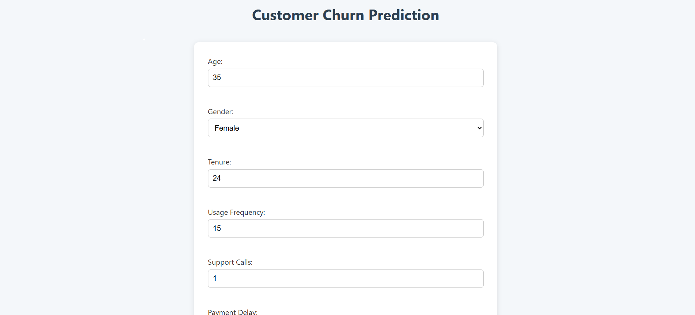
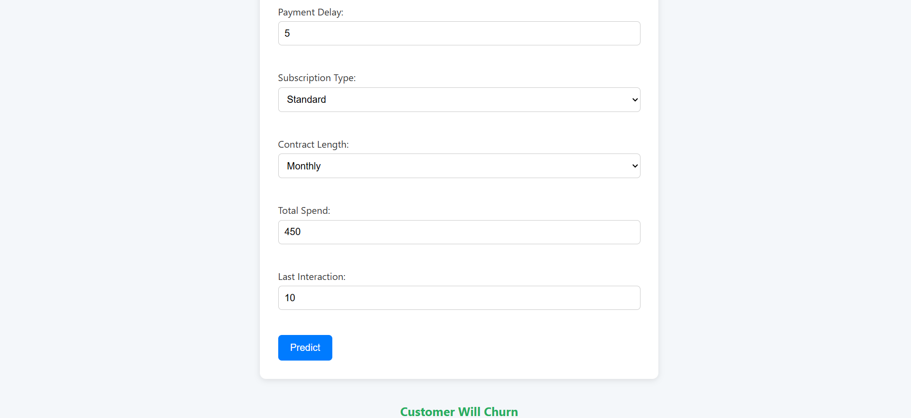

# 📉 Customer Churn Prediction Web App

A web application built with **Flask** that predicts customer churn using a **Logistic Regression** model trained on customer behavior data.

## 🧠 About

This project helps businesses identify customers who are likely to stop using their service (churn) based on various attributes. The predictive model uses Logistic Regression and provides real-time predictions through a user-friendly web interface.

---

## 🚀 Features

- Predict customer churn based on behavior and demographic features
- Logistic Regression model for binary classification
- Interactive web interface using Flask
- Input fields for all customer attributes
- Clean, simple, and easy-to-use UI

---

## 🛠️ Tech Stack

- **Frontend**: HTML, CSS 
- **Backend**: Python, Flask
- **Machine Learning**: Scikit-learn (Logistic Regression)
- **Model Serialization**: `pickle`

---

## 📂 Input Features

| Feature             | Description                                          |
|---------------------|------------------------------------------------------|
| Age                 | Age of the customer                                  |
| Gender              | Male/Female                                          |
| Tenure              | Duration of association with the service             |
| Usage Frequency     | Number of times the service is used                  |
| Support Calls       | Number of support calls made                         |
| Payment Delay       | Days of delay in payment                             |
| Subscription Type   | Basic / Premium / Enterprise                         |
| Contract Length     | Duration of current subscription (in months)         |
| Total Spend         | Total amount spent by the customer                   |
| Last Interaction    | Days since last interaction with the service         |

---

## 🖥️ How to Run Locally

1. **Clone the repository**

   git clone https://github.com/suhanakesharwani/customer-churn-flask-app.git
   cd customer-churn-flask-app

2. Install dependencies

    pip install -r requirements.txt

3. Run the Flask app

    python app.py

4. Open in browser

    http://127.0.0.1:5000/
    
## Project Structure 

customer-churn-flask-app/
├── app.py              
├── model.pkl           
├── train_model.py      
├── templates/
│   └── index.html       
├── static/
│   └── style.css       
├── requirements.txt     
└── README.md            

## 📷 Screenshot

## ✅ Future Improvements

Add support for more advanced ML models (e.g., Random Forest, XGBoost)

Visualize prediction probabilities

Add database integration for storing inputs and outputs

Improve UI with better design

## 🧑‍💻 Author

Suhana Kesharwani
📧 suhanakesharwani@gmail.com
